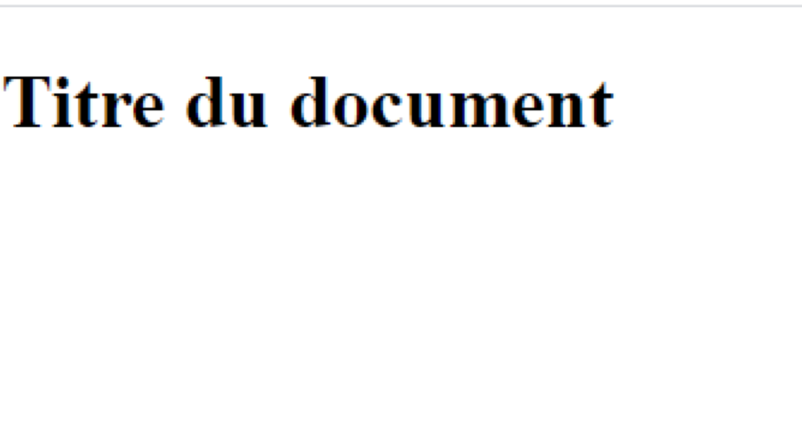
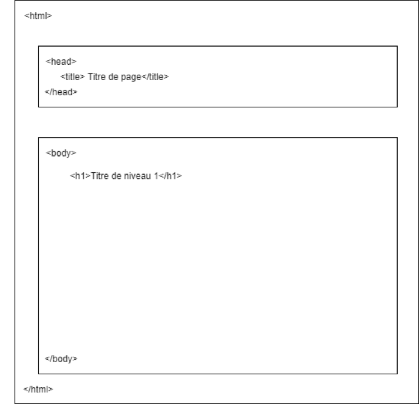

Cette introduction au cours du langage HTML traite, de manière générale, des différentes fonctions de ce langage et de sa sémantique générale.

Le HTML est le langage de base se trouvant derrière toutes les pages webs. Il permet de la structurer, mais ne permet pas la mise en forme du site. 

Ce cours se base sur les dernières versions stables de ce langage, à savoir HTML5 au moment où ces lignes sont écrites.

## Qu'est-ce que le HTML?

- Le HTML est l’acronyme de Hyper Text Markup Language
- Le HTML est le langage de balisage standard pour la création de pages Web
- Le HTML décrit la structure d'une page Web
- Le HTML se compose d'une série d'éléments entourés de balises.
- Les éléments HTML indiquent au navigateur comment organiser le contenu
- Les balises autour des éléments HTML permettent d’indiquer le type de contenu (titre, paragraphe, liste, tableau, etc.).

L’exemple ci-dessous présente la structure de base d’une page HTML, avec un titre :

``` html
<!DOCTYPE html>
<html lang="fr">
<head>
    <meta charset="UTF-8" />
    <title>Cours HTML</title>
</head>
<body>
    <h1>Titre du document</h1>
</body>
</html>
```

Dans l’exemple ci-dessus, la déclaration ```<!DOCTYPE html>``` indique au navigateur que le document contient du HTML ainsi que la version du langage utilisée pour la construction du site web.

Ensuite, la balise ```<html>``` permet d’indiquer au navigateur que le code HTML commence à cet endroit. Cette balise - comme beaucoup en HTML - est fermée à la fin du document avec ```</html>```, indiquant que le document HTML s’arrête à cet endroit. De plus, l’attribut ```lang="fr"``` permet d’indiquer que la page web est rédigée en français.

Les balises ```<head></head>``` reçoivent des informations qui ne seront pas directement affichées sur la page web. Dans l’exemple ci-dessus, la ligne suivante : ```<meta charset="utf-8" />``` permet d’indiquer que le document utilise l’encodage UTF-8, permettant d’afficher correctement les accents. Elle contient aussi la balise ```<title>``` permettant de définir un titre pour la page web, titre qui sera affiché dans l’onglet du navigateur.

Enfin, les balises ```<body></body>``` définissent le corps de la page HTML. Tout ce qui se trouve entre ces balises est affiché dans la page web. Dans l’exemple ci-dessus, il y a un titre, entouré des balises ```<h1></h1>```. C’est également entre les balises ```<body></body>``` qu’il y aura les paragraphes, les en-tête, etc.

## Qu'est-ce qu'un élément HTML?

En HTML, un élément est entouré de deux balise : **une balise de début**, dite “ouvrante”, contenant le nom de l’élément, puis **le contenu de l’élément**, pour finir avec une **balise de fin**, dite “fermante”, commençant par un slash (/) pour indiquer c’est une balise fermante. Le nom de l’élément indiqué dans la balise se trouve entre des chevrons : ```<>```.

Exemple :

```html
<h1>Introduction au HTML</h1>
```

L’exemple ci-dessus est constitué d’une balise d’ouverture ```<h1>``` et d’une balise de fermeture ```</h1>``` afin d’indiquer que cet élément est un titre.

## Navigateurs Web

Le rôle principal des navigateurs web tels que Google Chrome, Mozilla Firefox, Opera, Safari, etc. est d’interpréter le code HTML dans le document et d’afficher la page web en tenant compte des balises. 

__Remarque__ : Les balises HTML ne sont pas affichées sur la page web, mais permettent d’indiquer au navigateur comment afficher tel ou tel élément. Par exemple, les titres ```<h1>``` sont affichés en gros.

En reprenant l’exemple de la structure de base d’un document HTML, donné dans le point “qu’est-ce que le HTML” : 

```html
<!DOCTYPE html>
<html lang="fr">
<head>
	<meta charset="utf-8" />
	<title>Titre de la page web</title>
</head>
<body>
	<h1>Titre du document</h1>
</body>
</html>
```

Voici ce que donne le code HTML de cet exemple :


Comme indiqué, les balises HTML ne sont pas affichées mais ont permis au navigateur d’afficher “Titre du document” en gros.

## Structure d’une page HTML

Afin de mieux visualiser comment est structurée une page web grâce au HTML, voici un schéma qui reprend le code de l’exemple du point précédent :


