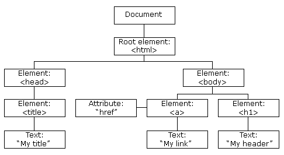

En JavaScript, grâce au DOM, il est possible de naviguer sur l’arbre de nœud grâce à la relation entre les nœuds.

## Les nœuds du DOM

Selon le standard W3C HTML DOM, tout, absolument tout, au sein d’un document HTML, est considéré comme un nœud :

- Le document entier est un nœud **document**
- Chaque élément HTML est un nœud **élément**
- Les textes à l’intérieur de chaque élément HTML sont des nœuds **texte**
- Tous les commentaires sont des nœuds **commentaires**



Avec le DOM HTML, tous les nœuds dans l’arbre de nœud sont accessibles en Javascript, et de nouveaux nœuds peuvent être créés. Tous les nœuds peuvent être modifiés ou effacés.

## Relations entre les nœuds

Dans l’arbre des nœuds, chacun à une relation hiérarchique avec les autres. Les termes suivants sont utilisés pour décrire ces relations : parents, enfants, frères.

Dans l’arbre, le nœud tout en haut est appelé **racine** (*root*, en anglais) ou nœud racine (*root node*). Chaque nœud a forcément un parent, excepté la racine qui, lui, n’en a pas ; un nœud a également un certain nombre d’enfants. Les nœuds frères et sœurs ont forcément le même nœud parent.


Exemple :

```js
<html>

  <head>
    <title>DOM Tutorial</title>
  </head>

  <body>
    <h1>DOM Lesson one</h1>
    <p>Hello world!</p>
  </body>

</html>
```

Voici la hiérarchie des nœuds dans le code HTML ci-dessus :

- ```<html>``` est le nœud racine
- ```<html>``` n’a pas de nœud parent
- ```<html>``` est le parent de ```<head>``` et ```<body>```
- ```<head>``` est le premier enfant de ```<html>``` 
- ```<body>``` est le dernier enfant de ```<html>```

De plus :

- ```<head>``` a un seul enfant : ```<title>```
- ```<title>``` a un enfant - un nœud texte : “DOM Tutorial”
- ```<body>``` a deux enfants ```<h1>``` et ```<p>```
- ```<h1>``` a un enfant : “DOM Lesson one”
- ```<p>``` a un enfant : “Hello World !”
- ```<h1>``` et ```<p>``` sont frères

## Naviguer entre les nœuds

Les propriétés suivantes sont utilisées afin de naviguer entre les nœuds en JavaScript :

- ```parentNode```
- ```childNodes[indexDuNoeud]```
- ```firstChild```
- ```lastChild```
- ```nextSibling```
- ```previousSibling```

## Nœuds enfants et valeurs des nœuds

Dans l’exemple plus haut, l’élément HTML ```<title>``` ne contient pas du texte, mais un **nœud de texte** ayant la valeur “DOM tutorial”.

La valeur du nœud de texte est accessible en utilisant la propriété innerHTML.

Exemple :

```js
myTitle = document.getElementById("demo").innerHTML;
```

En fait, accéder à la propriété **innerHTML** revient au même que d’accéder à la propriété **nodeValue** du premier enfant.

Exemple :

```js
myTitle = document.getElementById("demo").firstChild.nodeValue;
```

Néanmoins, accéder au premier enfant peut également se faire de la manière suivante :

```js
myTitle = document.getElementById("demo").childNodes[0].nodeValue;
```

### innerHTML

Dans ce cours, la propriété **innerHTML** est utilisée afin d’accéder au contenu d’un nœud texte. Cependant, savoir utiliser les autres techniques montrées est utile pour bien comprendre les principes d’arbre de nœuds et de relations entre les nœuds.

## Nœud racine dans le DOM

Il existe deux propriétés permettant d’accéder à la totalité d’un document HTML :

- ```document.body``` : donne accès à toute la partie ```body``` d’un document
- ```document.documentElement``` : donne accès à la totalité du document

Exemple :

```js
<html>
<body>

<h2>JavaScript HTMLDOM</h2>
<p>Displaying document.body</p>

<p id="demo"></p>

<script>
    document.getElementById("demo").innerHTML = document.body.innerHTML;
</script>

</body>
</html>
```

Dans cet exemple, toute la partie ```body``` du document est retournée grâce à la propriété ```document.body```.

Exemple :

```js
<html>
<body>

<h2>JavaScript HTMLDOM</h2>
<p>Displaying document.documentElement</p>

<p id="demo"></p>

<script>
    document.getElementById("demo").innerHTML = document.documentElement.innerHTML;
</script>

</body>
</html>
```

Cet exemple retourne le contenu de la totalité du document, grâce à l’utilisation de la propriété ```document.documentElement```.

## La propriété nodeName

Cette propriété permet d’obtenir le nom d’un nœud. Voici ses spécificités :

- Cette propriété est en lecture seule - donc pas modifiable
- Le nom du nœud d’un élément est le même que le nom du tag
- ```nodeName``` d’un attribut est le même que le nom de l’attribut en question
- Le ```nodeName``` d’un nœud texte est toujours ```#text```.
- Le ```nodeName``` d’un document est toujours ```#document```
__Remarque__ : ```nodeName``` contient toujours le nom du tag en majuscule.

Exemple :

```js
<h1 id="id01">My First Page</h1>
<p id="id02"></p>

<script>
    document.getElementById("id02").innerHTML = document.getElementById("id01").nodeName;
</script>
```

## La propriété nodeValue

Cette propriété permet d’obtenir la **valeur** d’un nœud.

La ```nodeValue``` pour les nœuds éléments est ```null```, celle des nœuds texte est le texte en lui-même et celle des attributs est la valeur de l’attribut.

## La propriété nodeType

Cette propriété est en lecture seule et retourne le type d’un nœud.

Exemple :

```js
<h1 id="id01">My First Page</h1>
<p id="id02"></p>

<script>
    document.getElementById("id02").innerHTML = document.getElementById("id01").nodeType;
</script>
```

Cet exemple retourne le type des nœuds ```id01``` et ```id02```.